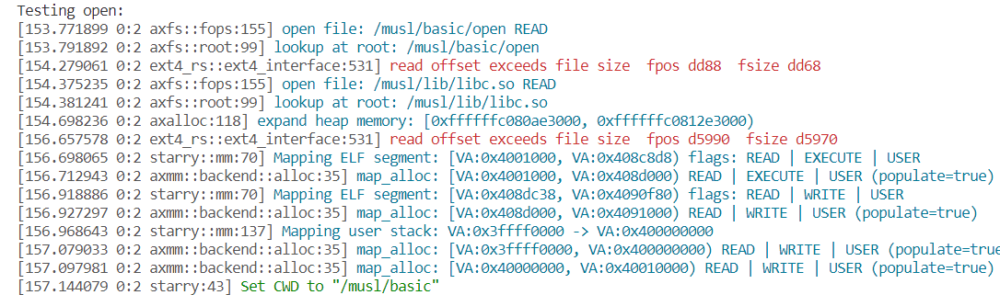
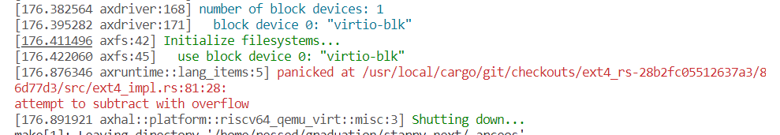

# 12/3

学rust，开始做rustlings训练营：https://opencamp.cn/os2edu/camp/2024fall/stage/1 ； https://github.com/LearningOS/rust-rustlings-2024-autumn-Ressed

在wsl2 ubuntu2004中

# 12/7

仓库地址 https://github.com/Ressed/Starry-On-ArceOS/tree/main 遵照readme能跑起来


ArceOS宏内核实践资料 https://thu-sast9.feishu.cn/docx/ICf2dVcZ5ouH86x2G2oc4GFlnCd

# 12/9

进展文档： https://docs.qq.com/doc/DWHdLREV2a1RqVmtC

# 12/15

1. 初赛测例：
  1. 源码：https://github.com/oscomp/testsuits-for-oskernel/tree/pre-2024/riscv-syscalls-testing
  2. 预编译下载链接：https://github.com/Starry-OS/testcases/releases/download/v0.1/riscv-syscall-testcases.tar.gz
  
直接把编译好的初赛测例塞到nimbos/build里，能跑，但感觉不太合适

看训练营课程，把第一个作业修改println!颜色做了

# 12/16

https://github.com/orgs/rcore-os/discussions/19 分析rust组件间关系的工具

# 12/30

下周四或周五 开题

大目标：宏内核 ；从上而下完成syscall，达到对linux支持；

一般比赛一等奖 ~120 syscall 分成四组
    man7 查到syscall描述 理解这个syscall需要操作系统哪些功能（组件） 在开题前分析清楚

    开题后由易到难实现
    
下周一开题报告初稿

英文阅读报告不强求

# 1/4

文件系统管理：实现的量较大，不过难度不高，后续会接入并改进ext4 crates https://github.com/Starry-OS/Starry-Old/blob/main/api/linux_syscall_api/src/syscall_fs/fs_syscall_id.rs


# 2/15

fork https://github.com/oscomp/starry-next

https://course.educg.net/sv2/indexexp/contest/contest_submit.jsp?contestID=UWCKUb9XwRc&my=false&contestCID=0#contestSubAn   用户 2025ostest1 / 2025ostest1

docker pull docker.educg.net/ai4s/os-contest:20250214


# 2/16

cp ~/riscv64-linux-musl-cross/bin/riscv64-linux-musl-gcc ~/riscv64-linux-musl-cross/bin/riscv64-linux-gcc

git clone https://gitlab.eduxiji.net/Azure_stars/starry-next/-/tree/4c6903790285a39e6f29933c63739f8185a18b8a


git clone https://github.com/oscomp/testsuits-for-oskernel/tree/pre-2025

在docker里构建出了两个img


# 2/17

## 使用docker测试运行starry-next
因为ubuntu20.04有些版本问题 所以暂且用docker测试

cd starry-next/.arceos/

### Build and Run through Docker

Install [Docker](https://www.docker.com/) in your system.

Then build all dependencies through provided dockerfile:

```bash
docker build -t arceos -f Dockerfile .
```

cd ..

```
docker run --env HTTP_PROXY=HTTP_PROXY="http://172.30.64.1:7890" --env HTTPS_PROXY="http://172.30.64.1:7890" -it -v $(pwd):$(pwd) -w $(pwd) --name arceos_env  arceos bash 

docker restart arceos_env

docker exec -it -u root arceos_env bash
```

# 2/18

只有riscv64运行时显示是这样


别的都是这样


不知道为什么

在docker里就可以运行
但是docker里make user_apps时显示
```
Building C user app
CMake Error: The current CMakeCache.txt directory /starry-next/apps/nimbos/c/build/CMakeCache.txt is different than the directory /home/ressed/graduation/starry-next/apps/nimbos/c/build where CMakeCache.txt t
CMake Error: The source "/starry-next/apps/nimbos/c/CMakeLists.txt" does not match the source "/home/ressed/graduation/starry-next/apps/nimbos/c/CMakeLists.txt" used to generate cache.  Re-run cmake with a d.

```


不知道什么时候在settings里给rust-analyzer加的features=[axstd,alloc]导致rust-analyzer报错，删了。

run了个评测环境的镜像cool_lumiere，尝试在里面用starry-next跑starry-next-gitlab里的junior，失败。


在arceos的docker里可以运行：
```
make clean
make AX_TESTCASE=junior LOG=off FEATURES=fp_simd ARCH=riscv64 BLK=y NET=y user_apps
make AX_TESTCASE=junior LOG=off FEATURES=fp_simd ARCH=riscv64 BLK=y NET=y run 
```

为了在容器内make后不影响容器外的rust-analyzer，把文件夹映射改成一样的路径：产生permission denied。解决：umask 0000

看testsuits-for-oskernel/basic里的测试用例，大概是junior的源代码。尝试一下实现openat。

# 2/20

docker外的rust-analyzer和docker内的编译行为不一致：docker外认为c_char是i8，docker内认为是u8。
    实际上是没在settings里指定target_arch，导致rust-analyzer认为是x86_64。

debug!输出 CStr::from_ptr(path) 时会卡死    

    因为sbi不能直接访问用户态的地址 riscv64 调用输出的是用 SBI 先把这个内存拷贝到内核里面的数组


https://github.com/oscomp/os-competition-info/blob/main/ref-info.md


# 2/24

    Starry 对 2025 年 OS 比赛已经完成了环境适配，能够运行 riscv64 和 loongarch64 的大部分 basic 测例，并可以支持在比赛平台上进行评测。
    - 原代码仓库：https://github.com/oscomp/starry-next
    - 在比赛平台上运行时的改造代码仓库：https://gitlab.eduxiji.net/Azure_stars/starry-next/-/tree/pre2025test（相比于 github 仓库进行了一些环境配置）
    - starry-next 内核使用说明：https://azure-stars.github.io/Starry-Tutorial-Book/ch01-00.html
    - 如何在 OS 比赛平台上测试 Starry 的说明：https://azure-stars.github.io/Starry-Tutorial-Book/ch01-00.html
  
在线评测结果


先编译testsuits


在docker里运行模拟评测


testsuits的makefile有问题 sdcard里把loongarch写成riscv64了

修改后


在更新后的github仓库运行


有问题。


# 2/25

重新开了个arceos-env 把整个graduation文件夹都映射进去

转而在starry-next-gitlab上使用arceos-env执行

```
make defconfig ARCH=riscv64 EXTRA_CONFIG=../configs/riscv64.toml
$ cp ./sdcard-rv.img arceos/disk.img
$ make AX_TESTCASE=oscomp ARCH=riscv64 EXTRA_CONFIG=../configs/riscv64.toml BLK=y NET=y FEATURES=fp_simd,lwext4_rs LOG=off run
```

能跑 大概以后在这上写了。


把旧的junior的testcase_list，加上前缀添加进来，尝试运行

```
/musl/basic/brk
/musl/basic/chdir
/musl/basic/clone
/musl/basic/close
/musl/basic/dup
/musl/basic/dup2
/musl/basic/execve
/musl/basic/exit
/musl/basic/fork
/musl/basic/fstat
/musl/basic/getcwd
/musl/basic/getdents
/musl/basic/getpid
/musl/basic/getppid
/musl/basic/gettimeofday
/musl/basic/mkdir_
/musl/basic/mmap
/musl/basic/mount
/musl/basic/munmap
/musl/basic/open
/musl/basic/openat
/musl/basic/pipe
/musl/basic/read
/musl/basic/sleep
/musl/basic/test_echo
/musl/basic/times
/musl/basic/umount
/musl/basic/uname
/musl/basic/unlink
/musl/basic/wait
/musl/basic/waitpid
/musl/basic/write
/musl/basic/yield
```

clone后会导致后续测例卡死


用户名 T202410003995072  ec


openat依然是坏的：对于相对地址的openat 尝试打开的却是绝对地址

把sys_openat重写成不依赖sys_open的了

运行测例时的cwd是/。为什么不是/musl/basic 呢

临时在加载测例时加上了set_current_dir  用来应付需要cwd的测例

read和open可以通过

mount还没实现所以没法测openat


# 2/27

在比赛平台 gitlab 上创建了仓库，之后在这里提交修改。

创建在线文档 https://github.com/Ressed/GraduationProjectRecords ，把之前的 note 迁移过来

看 openat 测例的实现

```
TEST_START(__func__);
//int fd_dir = open(".", O_RDONLY | O_CREATE);
int fd_dir = open("./mnt", O_DIRECTORY);
printf("open dir fd: %d\n", fd_dir);
int fd = openat(fd_dir, "test_openat.txt", O_CREATE | O_RDWR);
printf("openat fd: %d\n", fd);
assert(fd > 0);
printf("openat success.\n");
```

应该要修改测例加入一个 ./mnt 目录

评测报错：


下一步 实现 mount

# 2/28

完成情况

```
/musl/basic/chdir P
/musl/basic/close P
/musl/basic/dup P
/musl/basic/dup2 F
/musl/basic/fstat F
/musl/basic/getcwd P
/musl/basic/getdents F
/musl/basic/mkdir_ P
/musl/basic/mount F
/musl/basic/open P
/musl/basic/openat F
/musl/basic/pipe F
/musl/basic/read T
/musl/basic/umount F
/musl/basic/unlink T
/musl/basic/write T
```


```
Testing fstat: 
qemu-system-riscv64: wrong value for queue_enable ffffffc0
```


尝试使用gdb：
```
make AX_TESTCASE=junior ARCH=riscv64 EXTRA_CONFIG=../configs/riscv64.toml BLK=y NET=y FEATURES=fp_simd,lwext4_rs LOG=info MODE=debug debug
```

在 cargo.mk 的 RUSTFLAGS里 加上-g，把makefile 的 MODE 默认改为 debug，make clean后重新执行，可以正常打断点。

加了调试信息后跑的好慢


#### openat


有锁冲突 把一个的作用域改小了

O_DIRECTORY 到底应该是多少？

mnt被当作文件了，即使有O_DIRECTORY：


这是因为 O_DIRECTORY 定义不一致？


先把ctypes_gen里的改成0x0200000了。openat, fstat通过。


# 3/2


### getdents

依然是把目录当成文件了


注释掉了File.open里的这一行，只要是dir就error


通过

TODO: 不要修改arceos，应该在上面改
    不是注释掉，而是在后面加上个 opts.read 是否可行？


### dup2

之前好像.img坏了 重新编译了一份就好了


# 3/3

### pipe

sys_clone 报错


已将clone的修复合并


### mount

定义了下sys_mount和sys_umount


# 3/4

### 在loongarch上测试，fstat过不去：

去掉assert的话完全是正常的，但就是assert fatal


怀疑是上面 axmm 那个warn的问题，可能导致用户程序看到的值和内核看到的值不一样。

并非，只是测例的syscall没返回 res


### execve


把相对路径改成绝对路径


# 3/5

从 yyy-dev 合并代码，riscv 下可以正常运行 execve

参考 starry-new 完成 mount 和 umount


# 3/6

从github合并修改

```
git add remote github ...
git log  github/main --oneline
git cherry-pick 478ec2f
git cherry-pick b5920b2
```

已通过全部basic测例在riscv64上，运行结果在basic-rv.out

loongarch 的 clone 相关测例出问题


把这个改回去就能对 不知道为什么


git可能以为我在windows下，把所有的LF给换成CRLF了，导致修改到vendors里的文件时，产生了checksum不一致。通过设置把core.autocrlf设为false解决。

cargo vendor 下下来的lwext crate 的EOL是CRLF，很奇怪

# 3/9

迁移修改到 github 

```
git add --renormalize .
sed -i 's/\r$//g' xxx
```

之前clone的仓库都有core.autocrlf=true 并且会导致文件被变成crlf的错误
    好像反而是仓库有问题，就是应该设成true?

读不到测例？
    testcase_list 的 crlf导致的

成功迁移了对openat的修改，但clone因为其他人改动太多不知道为什么还是不行。


# 3/10

SMP=1 riscv64 clone会panic:
    

重新起个docker试试

```
docker run --privileged --rm -it -v $(pwd):$(pwd) -w $(pwd) --name arceos_env arceos bash
```

不用了，改用 AsakuraMizu/arceos 就好了，riscv64下所有basic样例都能过

应该是测例更新导致的，换用之前编译好的测例也能在main下通过。

# test ext4 crates

.arceos# git checkout -b test_ext4  

https://github.com/oscomp/os-competition-info/blob/main/ref-info.md#ext4%E6%96%87%E4%BB%B6%E7%B3%BB%E7%BB%9F%E5%8F%82%E8%80%83%E5%AE%9E%E7%8E%B0 

### Azure-stars/lwext4_rust

### yuoo655/ext4_rs

加入feature ext4_rs

尝试运行

```
git clone https://github.com/yuoo655/ext4libtest.git
cd ext4libtest
sh gen_img.sh
# cargo run /path/to/mountpoint
cargo run ./foo/
```


sudo apt-get install fuse3 libfuse3-dev


参考文档： https://github.com/Starry-OS/Starry/blob/d2f795624b73f35159e68369cf9fef542a025ee6/doc/ext4fs.md?plain=1#L10

https://github.com/Starry-OS/Starry-Old/blob/53c549aa1e2ebe22b27ec8c474df041faf0ef4b7/modules/axfs/src/fs/ext4_rs.rs#L4

### PKTH-Jx/another_ext4


:: 这两个目前没有接入的ext4 crate 可能存在bug， 可以分析他们的情况，作为毕设工作的一部分

# 3/11

对比 Starry-Old/lwext4_rust.rs 和 现在的 似乎只有logging上有区别

那为什么直接把 ext4_rs.rs 搬过来不行呢？


改用  rev= "6bcc7f5" 的话 可以成功编译，但不识别现有的.img

# 3/12

在创建.img 时，给 mkfs.ext4 加上参数 -b 4096，可以成功在 ext4_rs/main 中读取sdcard-rv.img

更新 testsuits-for-oskernel 到 2025_multiarch 分支，加上 -b 4096 参数编译测例

卡死


改用MODE=debug后又不卡死了？但是会panic




换到commit 86d77d3 变了一种报错



# 3/13

尝试采用最新版本并修改 ext4_rs.rs

TODO:

    优先做libc-test syscall，让ci测一下所有的basic 测例 文件相关的

    Linux-UNIX 系统编程手册

    按syscall分，写 syscall 手动编写测例测试

    testcases/test_syscall_code/


# 3/15

目前的starry/main + arceos/main 没法编译，等待pr。

# 3/16

目前main下文件相关basic通过情况

```
target_testcases = [
    "test_brk",
    "test_chdir",
    "test_execve",
    "test_close",
    "test_dup",
    "test_dup2",
    "test_fstat",
    "test_getcwd",
    "test_mkdir",
    "test_open",
    "test_pipe",
    "test_read",
    "test_unlink",
    "test_write",
    # "test_openat",
    # "test_getdents",
    # "test_mount",
    # "test_umount",
]
```

其中注释掉的为未通过。

等待 pr fix: open directory #19 合并

分工： https://docs.qq.com/sheet/DWmZZenJ6dk9VQ2tr?tab=BB08J2

test_pipe 有时会不通过：


结果随机：
```
========== START test_pipe ==========
cpid: cpid: 0
11
  Write to pipe successfully.

========== END test_pipe ==========

========== START test_pipe ==========
cpid: 11
cpid: 0
  Write to pipe successfully.

========== END test_pipe ==========

========== START test_pipe ==========
cpid: cpid: 11
0
  Write to pipe successfully.

========== END test_pipe ==========

========== START test_pipe ==========
cpid: 0
cpid: 11
  Write to pipe successfully.

========== END test_pipe ==========
```

# 3/17

##### 目前通过ci的文件相关 basic 测例：

|                              | **riscv64** | **x86_64** | **aarch64** | **loongarch64** |
| ---------------------------- | ----------- | ---------- | ----------- | --------------- |
| **chdir**          | ✅           | ✅          | ✅           | ✅               |
| **close**        | ✅           | ✅          | ✅           | ✅               |
| **dup**        | ✅           | ✅          | ✅           | ✅               |
| **dup2**       | ✅           | ✅          | ✅           | ✅               |
| **fstat**      | ✅           | ✅          | ✅           | ✅               |
| **getcwd**         | ✅           | ✅          | ✅           | ✅               |
| **mkdir_**       | ✅           | ✅          | ✅           | ✅               |
| **open**      | ✅           | ✅          | ✅           | ✅               |
| **read**        | ✅           | ✅          | ✅           | ✅               |
| **unlink** | ✅           | ✅          | ✅           | ✅               |
| **write**        | ✅           | ✅          | ✅           | ✅               |
| **openat**        | ✅           | ✅          | ✅           | ✅               |
| **getdents**         | ✅           | ✅          | ✅           | ✅               |
| **pipe**        | ✅           | ✅          | ✅           | ✅               |
| **mount**        |            |           |            |                |
| **umount**         |            |           |            |                |

提了个PR修复basic judge 相关问题 https://github.com/oscomp/starry-next/pull/15

mount 还没迁移

尝试运行 libctest 的 fdopen


# 3/20

创建 apps/tests/

test_open，先使用 std
```
void test_open() {
	// O_RDONLY = 0, O_WRONLY = 1
	FILE *fd = fopen("./text.txt", "r");
	assert(fd >= 0);
	char buf[256];
	int size = fread(buf, 256, 1, fd);
	if (size < 0) {
		size = 0;
	}
    puts(buf);
	fclose(fd);
}
```

编译到build/里，然后进行打包，因为要进行 mount ，所以只能在现在的容器外跑

```
sudo ./build_img.sh -a x86_64 -fs ext4 -file apps/tests/build/ -s 30
```

以正常方式运行

等待 arceos 恢复正常