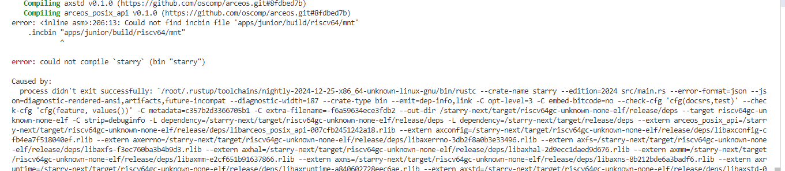

# 12/3

学rust，开始做rustlings训练营：https://opencamp.cn/os2edu/camp/2024fall/stage/1 ； https://github.com/LearningOS/rust-rustlings-2024-autumn-Ressed

在wsl2 ubuntu2004中

# 12/7

仓库地址 https://github.com/Ressed/Starry-On-ArceOS/tree/main 遵照readme能跑起来


ArceOS宏内核实践资料 https://thu-sast9.feishu.cn/docx/ICf2dVcZ5ouH86x2G2oc4GFlnCd

# 12/9

进展文档： https://docs.qq.com/doc/DWHdLREV2a1RqVmtC

# 12/15

1. 初赛测例：
  1. 源码：https://github.com/oscomp/testsuits-for-oskernel/tree/pre-2024/riscv-syscalls-testing
  2. 预编译下载链接：https://github.com/Starry-OS/testcases/releases/download/v0.1/riscv-syscall-testcases.tar.gz
  
直接把编译好的初赛测例塞到nimbos/build里，能跑，但感觉不太合适

看训练营课程，把第一个作业修改println!颜色做了

# 12/16

https://github.com/orgs/rcore-os/discussions/19 分析rust组件间关系的工具

# 12/30

下周四或周五 开题

大目标：宏内核 ；从上而下完成syscall，达到对linux支持；

一般比赛一等奖 ~120 syscall 分成四组
    man7 查到syscall描述 理解这个syscall需要操作系统哪些功能（组件） 在开题前分析清楚

    开题后由易到难实现
    
下周一开题报告初稿

英文阅读报告不强求

# 1/4

文件系统管理：实现的量较大，不过难度不高，后续会接入并改进ext4 crates https://github.com/Starry-OS/Starry-Old/blob/main/api/linux_syscall_api/src/syscall_fs/fs_syscall_id.rs


# 2/15

fork https://github.com/oscomp/starry-next

https://course.educg.net/sv2/indexexp/contest/contest_submit.jsp?contestID=UWCKUb9XwRc&my=false&contestCID=0#contestSubAn   用户 2025ostest1 / 2025ostest1

docker pull docker.educg.net/ai4s/os-contest:20250214


# 2/16

cp ~/riscv64-linux-musl-cross/bin/riscv64-linux-musl-gcc ~/riscv64-linux-musl-cross/bin/riscv64-linux-gcc

git clone https://gitlab.eduxiji.net/Azure_stars/starry-next/-/tree/4c6903790285a39e6f29933c63739f8185a18b8a


git clone https://github.com/oscomp/testsuits-for-oskernel/tree/pre-2025

在docker里构建出了两个img


# 2/17

## 使用docker测试运行starry-next
因为ubuntu20.04有些版本问题 所以暂且用docker测试

cd starry-next/.arceos/

### Build and Run through Docker

Install [Docker](https://www.docker.com/) in your system.

Then build all dependencies through provided dockerfile:

```bash
docker build -t arceos -f Dockerfile .
```

cd ..

```
docker run --env HTTP_PROXY=HTTP_PROXY="http://172.30.64.1:7890" --env HTTPS_PROXY="http://172.30.64.1:7890" -it -v $(pwd):$(pwd) -w $(pwd) --name arceos_env  arceos bash 

docker restart arceos_env

docker exec -it -u root arceos_env bash
```

# 2/18

只有riscv64运行时显示是这样


别的都是这样


不知道为什么

在docker里就可以运行
但是docker里make user_apps时显示
```
Building C user app
CMake Error: The current CMakeCache.txt directory /starry-next/apps/nimbos/c/build/CMakeCache.txt is different than the directory /home/ressed/graduation/starry-next/apps/nimbos/c/build where CMakeCache.txt t
CMake Error: The source "/starry-next/apps/nimbos/c/CMakeLists.txt" does not match the source "/home/ressed/graduation/starry-next/apps/nimbos/c/CMakeLists.txt" used to generate cache.  Re-run cmake with a d.

```


不知道什么时候在settings里给rust-analyzer加的features=[axstd,alloc]导致rust-analyzer报错，删了。

run了个评测环境的镜像cool_lumiere，尝试在里面用starry-next跑starry-next-gitlab里的junior，失败。


在arceos的docker里可以运行：
```
make clean
make AX_TESTCASE=junior LOG=off FEATURES=fp_simd ARCH=riscv64 BLK=y NET=y user_apps
make AX_TESTCASE=junior LOG=off FEATURES=fp_simd ARCH=riscv64 BLK=y NET=y run 
```

为了在容器内make后不影响容器外的rust-analyzer，把文件夹映射改成一样的路径：产生permission denied。解决：umask 0000

看testsuits-for-oskernel/basic里的测试用例，大概是junior的源代码。尝试一下实现openat。

# 2/20

docker外的rust-analyzer和docker内的编译行为不一致：docker外认为c_char是i8，docker内认为是u8。
    实际上是没在settings里指定target_arch，导致rust-analyzer认为是x86_64。

debug!输出 CStr::from_ptr(path) 时会卡死    

    因为sbi不能直接访问用户态的地址 riscv64 调用输出的是用 SBI 先把这个内存拷贝到内核里面的数组


https://github.com/oscomp/os-competition-info/blob/main/ref-info.md


# 2/24

    Starry 对 2025 年 OS 比赛已经完成了环境适配，能够运行 riscv64 和 loongarch64 的大部分 basic 测例，并可以支持在比赛平台上进行评测。
    - 原代码仓库：https://github.com/oscomp/starry-next
    - 在比赛平台上运行时的改造代码仓库：https://gitlab.eduxiji.net/Azure_stars/starry-next/-/tree/pre2025test（相比于 github 仓库进行了一些环境配置）
    - starry-next 内核使用说明：https://azure-stars.github.io/Starry-Tutorial-Book/ch01-00.html
    - 如何在 OS 比赛平台上测试 Starry 的说明：https://azure-stars.github.io/Starry-Tutorial-Book/ch01-00.html
  
在线评测结果


先编译testsuits


在docker里运行模拟评测


testsuits的makefile有问题 sdcard里把loongarch写成riscv64了

修改后


在更新后的github仓库运行


有问题。


# 2/25

重新开了个arceos-env 把整个graduation文件夹都映射进去

转而在starry-next-gitlab上使用arceos-env执行

```
make defconfig ARCH=riscv64 EXTRA_CONFIG=../configs/riscv64.toml
$ cp ./sdcard-rv.img arceos/disk.img
$ make AX_TESTCASE=oscomp ARCH=riscv64 EXTRA_CONFIG=../configs/riscv64.toml BLK=y NET=y FEATURES=fp_simd,lwext4_rs LOG=off run
```

能跑 大概以后在这上写了。


把旧的junior的testcase_list，加上前缀添加进来，尝试运行

```
./musl/basic/brk
./musl/basic/chdir
./musl/basic/clone
./musl/basic/close
./musl/basic/dup
./musl/basic/dup2
./musl/basic/execve
./musl/basic/exit
./musl/basic/fork
./musl/basic/fstat
./musl/basic/getcwd
./musl/basic/getdents
./musl/basic/getpid
./musl/basic/getppid
./musl/basic/gettimeofday
./musl/basic/mkdir_
./musl/basic/mmap
./musl/basic/mount
./musl/basic/munmap
./musl/basic/open
./musl/basic/openat
./musl/basic/pipe
./musl/basic/read
./musl/basic/sleep
./musl/basic/test_echo
./musl/basic/times
./musl/basic/umount
./musl/basic/uname
./musl/basic/unlink
./musl/basic/wait
./musl/basic/waitpid
./musl/basic/write
./musl/basic/yield
```

clone后会导致后续测例卡死


用户名 T202410003995072  ec


openat依然是坏的：对于相对地址的openat 尝试打开的却是绝对地址

把sys_openat重写成不依赖sys_open的了

运行测例时的cwd是/。为什么不是/musl/basic 呢

临时在加载测例时加上了set_current_dir  用来应付需要cwd的测例

read和open可以通过

mount还没实现所以没法测openat


# 2/27

在比赛平台 gitlab 上创建了仓库，之后在这里提交修改。

创建在线文档 https://github.com/Ressed/GraduationProjectRecords ，把之前的 note 迁移过来

看 openat 测例的实现

```
TEST_START(__func__);
//int fd_dir = open(".", O_RDONLY | O_CREATE);
int fd_dir = open("./mnt", O_DIRECTORY);
printf("open dir fd: %d\n", fd_dir);
int fd = openat(fd_dir, "test_openat.txt", O_CREATE | O_RDWR);
printf("openat fd: %d\n", fd);
assert(fd > 0);
printf("openat success.\n");
```

这个 ./mnt 是哪来的呢