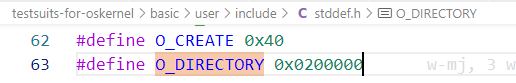
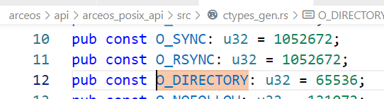

在比赛平台的 gitlab 上新建仓库，作为主要的开发仓库：https://gitlab.eduxiji.net/T202410003995072/starry-next/-/tree/pre2025test?ref_type=heads

依次运行 basic 测例，初始通过状况如下：

```
# Passed:
/musl/basic/chdir
/musl/basic/close
/musl/basic/dup
/musl/basic/getcwd
/musl/basic/mkdir_
/musl/basic/unlink
/musl/basic/write

# Failed:
/musl/basic/open
/musl/basic/read
/musl/basic/openat
/musl/basic/getdents
/musl/basic/fstat
/musl/basic/dup2
/musl/basic/pipe
/musl/basic/mount
/musl/basic/umount
```

依次进行修改。

过程中，尝试使用 gdb 进行 debug：

在 makefile 中为编译加上参数 RUSTFLAGS="-g"，make debug时指定MODE 为 debug 。

```
make AX_TESTCASE=junior ARCH=riscv64 EXTRA_CONFIG=../configs/riscv64.toml BLK=y NET=y FEATURES=fp_simd,lwext4_rs LOG=info MODE=debug debug
```

可以正常使用 gdb debug，但问题是打开调试信息后运行速度过慢，仅仅初始化就需要 5 分钟以上。

### open, read

问题： 相对于 CWD 打开的openat，尝试打开的却是绝对地址；运行测例时的 CWD 是/，应该是/musl/basic。

修复：在加载测例时进行 set_current_dir 为应有的目录；重写 sys_openat 。

### openat, fstat

问题1：测例中需要使用 ./mnt 目录，但不包含在测例文件中。

修复：已反馈，增加了./mnt 目录。

问题2：handle_relative_path 中有锁冲突，from_fd 也需要获取锁。

/image.png>)

修复：修改了获取写锁的作用域（实际上改成获取读锁也可以）。

问题3：O_DIRECTORY 在 arceos_posix_api 中与在测例用户库中定义不一致，导致没有强制作为目录打开。





修复：将 ctypes_gen.rs 中的值改为了 0x0200000 。

### getdents

问题：在没有 O_DIRECTORY flag时，有时目录会被当作文件打开。

修复：注释掉了File.open里的这一行，使得只要类型是 dir 就返回（否则会作为 File 打开，导致后续错误）。


### dup2

问题：不知道什么原因，之前编译的 sdcard.img 不完整，不包含 dup2。

修复：重新编译。


### mount, umount

问题：尚未实现 sys_mount。

修复：正在实现中。

### pipe

问题：sys_clone 无法正常使用。

修复：正在准备合并。
