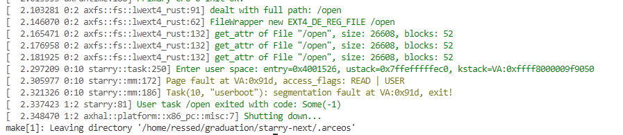

### 尝试创建并运行新测例


创建 apps/tests/

test_open，先使用 std
```
void test_open() {
	// O_RDONLY = 0, O_WRONLY = 1
	FILE *fd = fopen("./text.txt", "r");
	assert(fd >= 0);
	char buf[256];
	int size = fread(buf, 256, 1, fd);
	if (size < 0) {
		size = 0;
	}
    puts(buf);
	fclose(fd);
}
```

编译到build/里，然后进行打包，因为要进行 mount ，所以只能在现在的容器外跑

```
sudo ./build_img.sh -a x86_64 -fs ext4 -file apps/tests/build/ -s 30
```

以正常方式运行



### 将之前实现的mount, umount 合入并提交 PR

合并后可通过全部 basic 测例

### 实现 utimensat

fork 了 arceos-org/axfs_crates

在VfsNodeAttr, VfsNodeOps加入查询和修改 atime, mtime 的接口，类型都为usize

自底向上地在axfs_lwext4_rust, axfs, arceos_posix_api 中加入相关函数，最终使得 syscall 可以修改 atime 和 mtime

已提交 PR